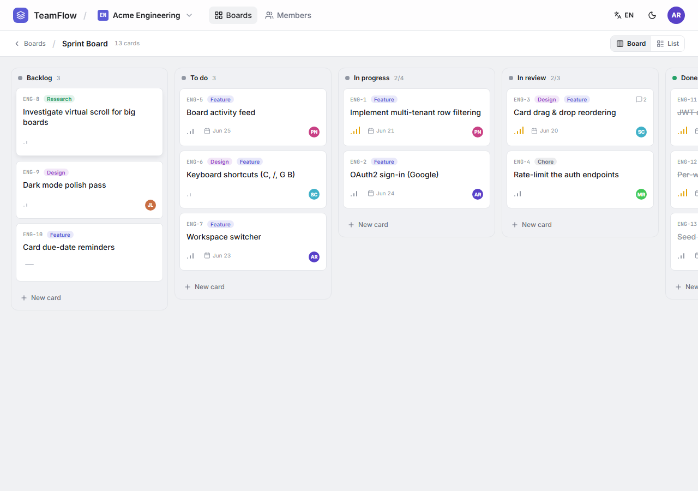
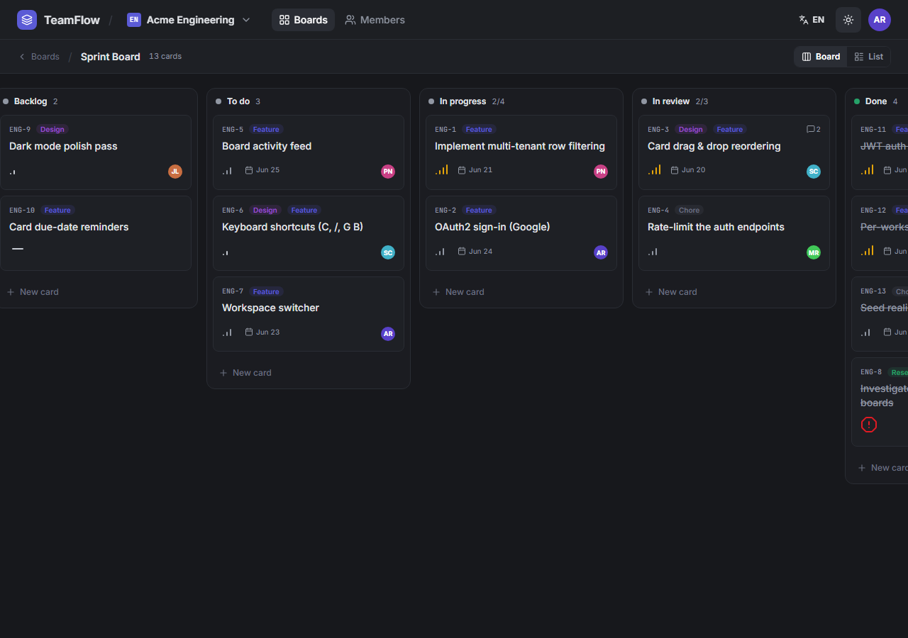
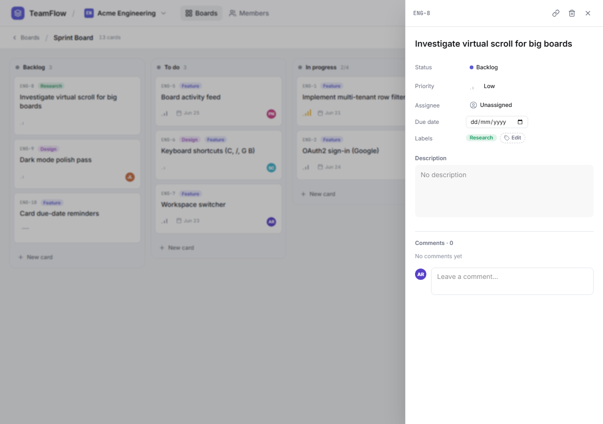
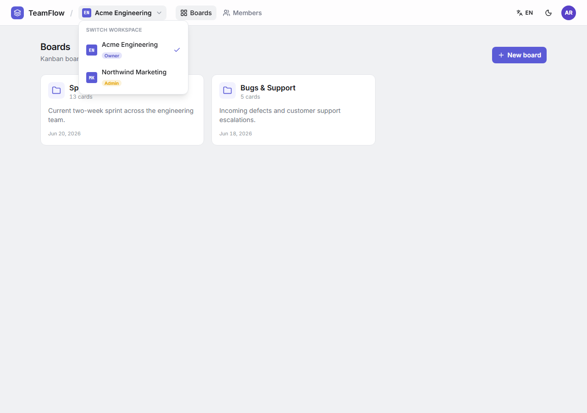
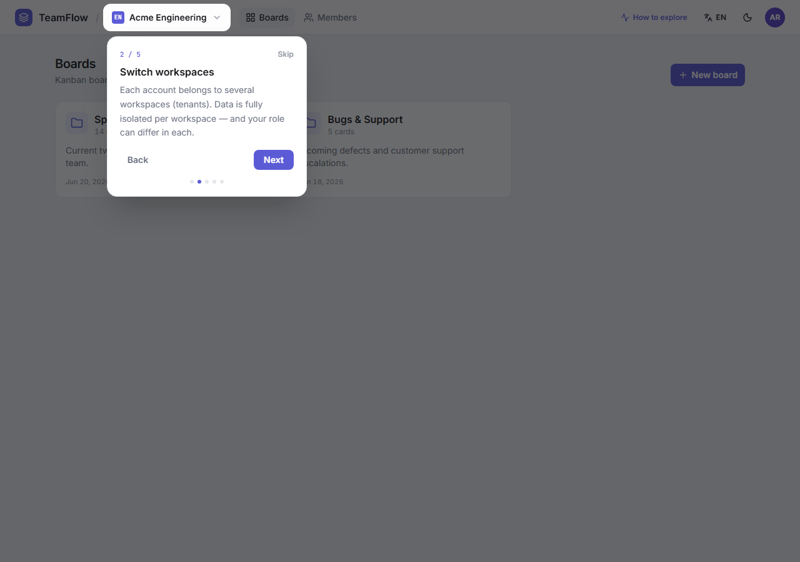
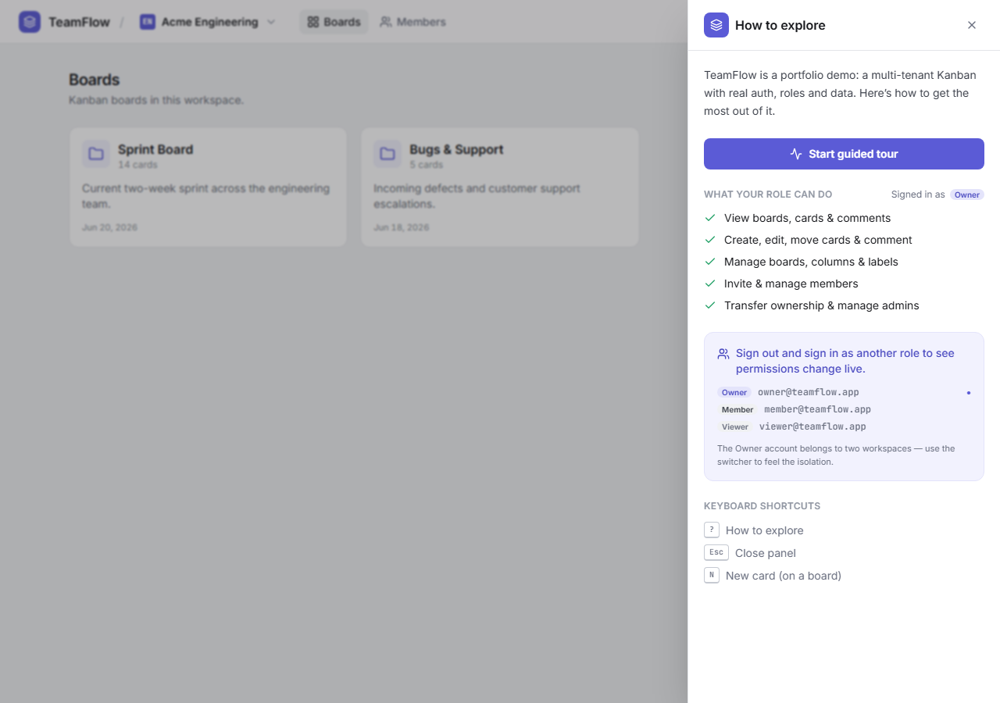

# TeamFlow — multi-tenant project management

A fast, Linear/Height-style **Kanban** with real **multi-tenant organizations**: one account spans
several workspaces, with fully isolated data and a **distinct role in each**. Built as a portfolio
piece with production-grade auth, per-workspace RBAC, tests, and a guided demo layer.

> **Status:** complete and runnable end-to-end locally. Cloud deploy is intentionally deferred
> (batched with the rest of the portfolio).

---

## Highlights

- **Multi-tenant by design** — a global EF Core query filter scopes every read to the active
  workspace; the tenant is resolved per request from the user's membership, so isolation can't be
  forgotten at a call site.
- **RBAC, four roles** — Owner / Admin / Member / Viewer, enforced on both the API (authorization
  filters) and the UI (capabilities + read-only affordances).
- **Kanban** — drag & drop across columns (Angular CDK) with fractional positions and auto-complete
  on the "Done" lane; plus a grouped **list view**.
- **Card detail panel** — inline edit of title/description, priority, assignee, due date, labels and a
  comment thread, all deep-linkable via `?card=`.
- **Auth** — JWT access + **rotating refresh tokens**, brute-force lockout, email **invitations** with
  hashed, expiring tokens.
- **Guided demo layer** — a coach-mark tour, an "How to explore" panel with a live **can/can't matrix**
  for your role, and a cross-role hint.
- **Polish** — first-class **dark mode**, **EN/ES** i18n, responsive at 390 / 768 / 1280, careful
  loading / empty / error states.

## Screenshots

| Kanban (light) | Kanban (dark) |
|---|---|
|  |  |

| Card detail panel | Workspace switcher (multi-tenant) |
|---|---|
|  |  |

| Guided tour | Explore panel (role can/can't) |
|---|---|
|  |  |

## Stack

| Layer | Tech |
|---|---|
| Frontend | Angular 20 (standalone + signals), Tailwind v4, Angular CDK, lucide-angular |
| Backend | .NET 9 Web API, Clean Architecture, FluentValidation |
| Database | SQL Server 2022 + EF Core 9 (global tenant query filter) |
| Auth | JWT access + rotating refresh, lockout, per-workspace RBAC, email invitations |
| Testing | 34 backend unit tests (xUnit) + Playwright E2E (auth, kanban, tour) |

## Run it locally

**Prerequisites:** .NET 9 SDK, Node 20+, SQL Server (local, Windows auth).

```bash
# 1. Backend — creates/migrates/seeds the TeamFlow database on first run
cd backend
dotnet run --project src/TeamFlow.Api          # → http://localhost:5190  (/health)

# 2. Frontend
cd frontend
npm install
npm start                                       # → http://localhost:4200
```

Open http://localhost:4200 and sign in with a demo account below.

### Demo accounts

| Role | Email | Password | Notes |
|---|---|---|---|
| Owner | `owner@teamflow.app` | `Owner123!` | Owner of *Acme Engineering*, Admin of *Northwind Marketing* — shows multi-tenancy |
| Member | `member@teamflow.app` | `Member123!` | Can edit cards & comment |
| Viewer | `viewer@teamflow.app` | `Viewer123!` | Read-only |

> Tip: sign in as different roles to feel permissions change live — the in-app **"How to explore"**
> panel spells out exactly what each role can do.

## Tests

```bash
# Backend unit tests
cd backend && dotnet test

# Frontend E2E (needs the API running on :5190; starts the web app itself)
cd frontend && npx playwright test
```

## Documentation

- [`docs/PHASES.md`](docs/PHASES.md) — phase-by-phase build log.
- [`TECHNICAL.md`](TECHNICAL.md) — architecture deep-dive (multi-tenancy, RBAC, auth, structure).

---

Built by **Luis Chiquito Vera** as part of a software-engineering portfolio.
